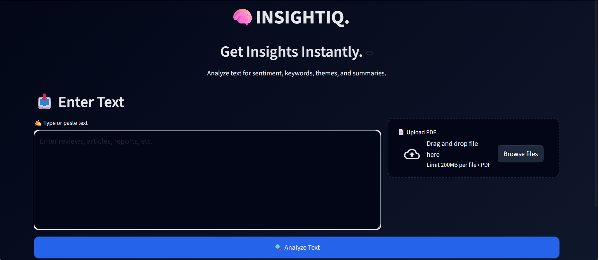
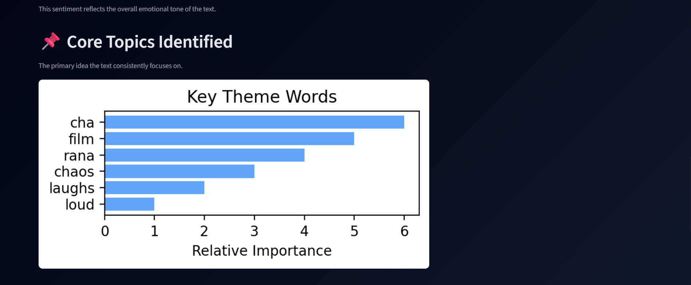
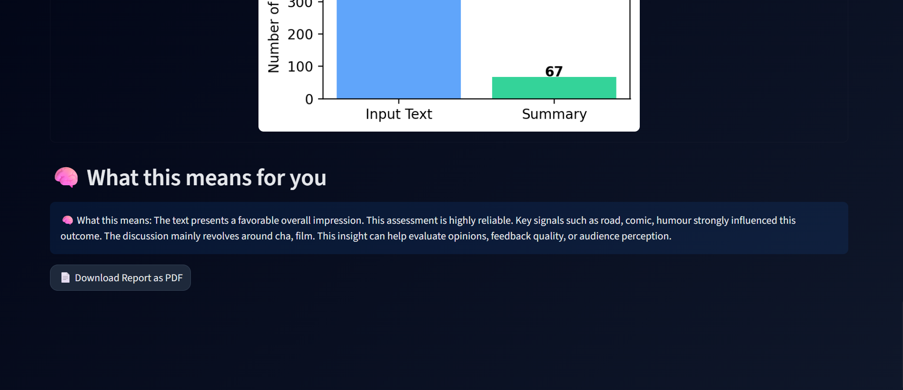

# INSIGHTIQ. - Dynamic Text Analysis System

## Overview
This project performs dynamic text analysis using Natural Language Processing (NLP).
It supports sentiment analysis, topic modeling, and text summarization through a
Streamlit-based interactive dashboard.

## Features
- Sentiment analysis using a trained ML classifier
- Topic modeling using TF-IDF and NMF
- Abstractive text summarization
- Interactive Streamlit UI
- PDF report generation

## Tech Stack
- Python
- Streamlit
- Scikit-learn
- NLTK
- Joblib

## Project Structure
- app.py – Main Streamlit application
- sentimentanalysis.py – Sentiment prediction logic
- summarization.py – Text summarization module
- main_topic_model.py – Topic modeling pipeline
- models/ – Pre-trained ML models (.joblib / .pkl)
- screenshots/-(dashboard.png,sentimentoutput.png,topic_modelling.png,summary.png)


## Screenshots

### Dashboard Interface


### Sentiment Analysis and Keywords


### Topic Modeling Results


### Text Summarization Output


### Summarization Insight


## How to Run
```bash
pip install -r requirements.txt
python -m streamlit run app.py
