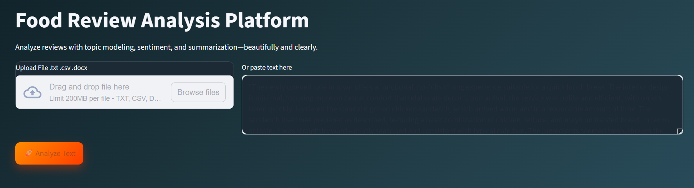
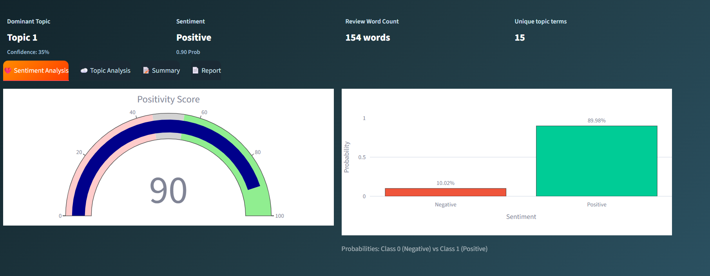
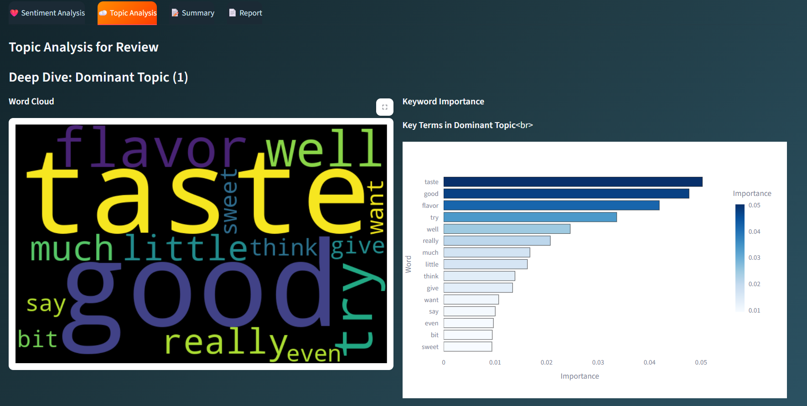
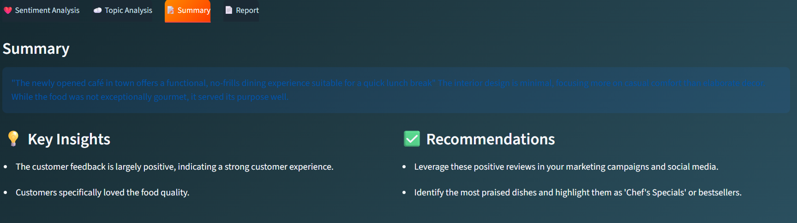

# 🍽️ Food Review Analysis Platform
A dynamic Streamlit-based text analysis system that allows users to upload or paste reviews, then performs:
- 📊 Sentiment Analysis (positive/negative with charts)
- ☁️ Topic Modeling (dominant keywords + wordcloud)
- 📝 Summarization (abstractive summary of the review)
- 📄 One‑click DOCX Report (mirrors UI visuals)


## 🚀 Features
- Upload `.txt`, `.csv`, `.docx` files or paste text directly
- Sentiment analysis with **gauge + bar chart (with % labels)**
- Dominant topic keywords with **wordcloud visualization**
- Abstractive summary using transformer models
- Insights + recommendations generated automatically
- Downloadable DOCX report (summary, sentiment chart, wordcloud, dominant keywords, insights, recommendations)

---
**UI Overview**

**Sentiment Analysis**

**Topic modeling**

**Summary and Insights**


## 📖 Usage
- Upload a file or paste text in the input box.
- Click 🚀 Analyze Text.
- Explore results in tabs:
- ❤️ Sentiment Analysis
- ☁️ Topic Analysis
- 📝 Summary & Insights
- 📄 Report
- Download the DOCX report.

---           

## 📂 Project Structure

```text
text_analysis_platform/
├── app.py                     # Main Streamlit dashboard
├── reporting.py         
├── summarizer.py              # NLP Summarization models     
├── validation.py              # Input data validation
├── sentiment_analysis.ipynb
├── assets/                    # Images for documentation
├── requirements.txt           # Project dependencies
└── topic_modeling.ipynb    
```   
    
## Dataset used - Amazon Fine Food reviews from kaggle

# 🛠️ Installation & Setup
Follow these steps to run the project locally:

### 1. Clone the repository
```bash
git clone [https://github.com/springboard5678x/Dynamic-Text-Analysis-System_Batch_27_nov.git](https://github.com/springboard5678x/Dynamic-Text-Analysis-System_Batch_27_nov.git)
cd Dynamic-Text-Analysis-System_Batch_27_nov
```
2. Install dependencies
```bash
pip install -r requirements.txt
```
3. Download NLP Models
```bash
# Download spaCy model
python -m spacy download en_core_web_sm
# Download nltk data
python -c "import nltk; nltk.download('stopwords')"
```

▶️ Run the App
Launch the dashboard using Streamlit:
```bash
streamlit run app.py
```

## Use cases
1. Brand Monitoring: Quickly track if customer sentiment is trending up or down.
2. Menu Engineering: Identify which dishes are "hits" and which ones need recipe changes.
3. Efficiency for Managers: Save hours by reading a single AI summary instead of 500 individual reviews.
4. Stakeholder Reporting: Create professional PDF/Word reports for owners or investors with one click.
5. Crisis Detection: Instantly flag negative words like "spoiled" or "rude" before they hurt your reputation.

## 🤝 Contributing
1. Fork the Project.
2. Create a Feature Branch:
```bash
git checkout -b feature/AmazingFeature
```
3. Commit your Changes:
```bash
git commit -m 'Add some AmazingFeature'
```
4. Push to the Branch:
```bash
git push origin feature/AmazingFeature
```
5. Open a Pull Request.

## 📝 License
This project is licensed under the MIT License — see the LICENSE file for details.
